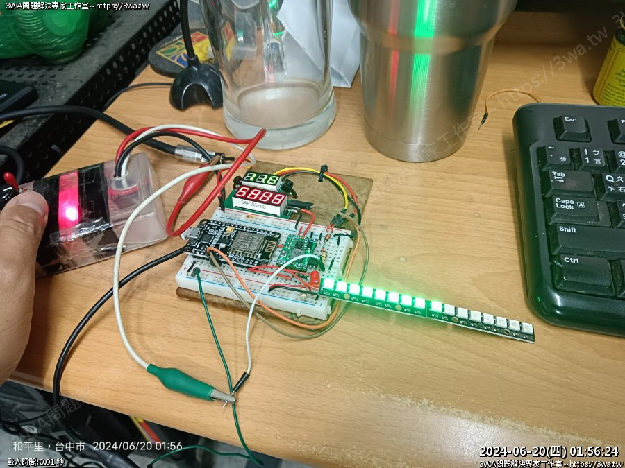

# RPM_TACHOMETER
Nodemcu V2 RPM Tachometer

七段顯示器 轉速表 RPM TACHOMETER

2024-06-20
新增 WS2812B Pixel RGB LED 輸出

<h2>相依套件</h2>
<ul>
  <li>1. Grove 4-Digit Display</li>
  <li>2. Adafruit NeoPixel</li>
</ul>

<h2>接腳</h2>
<ul>
  <li>D7：TM1637 CLK</li>
  <li>D6：TM1637 DIO</li>
  <li>D1：PWM 輸入</li>
  <li>D2：WS2812B Pixel RGB LED 輸出</li>
</ul>

 
<video autoplay loop style="width:100%; height: auto;">
  <source src="screenshot/PIXEL.mp4" type="video/mp4" />
</video>  
 

 

 
 
 
詳細心得參考：
<ul>
  <li>1. 影片：https://youtu.be/PMCvIjvCGIU</li>
  <li>2. 說明：https://3wa.tw/blog/blog.php?id=1929</li>
</ul>  
