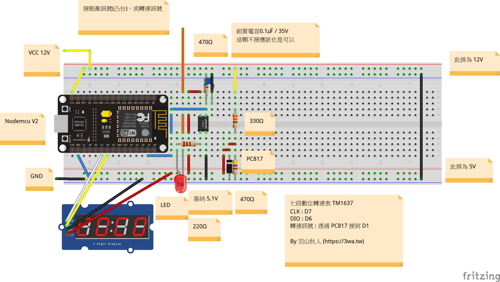

# RPM_TACHOMETER
Nodemcu V2 RPM Tachometer

七段顯示器 轉速表 RPM TACHOMETER

<h2>接腳</h2>
<ul>
  <li>D7：TM1637 CLK</li>
  <li>D6：TM1637 DIO</li>
  <li>D1：PWM 輸入</li>
</ul>

 
 
 
詳細心得參考：
<ul>
  <li>1. 影片：https://youtu.be/PMCvIjvCGIU</li>
  <li>2. 說明：https://3wa.tw/blog/blog.php?id=1929</li>
</ul>  
